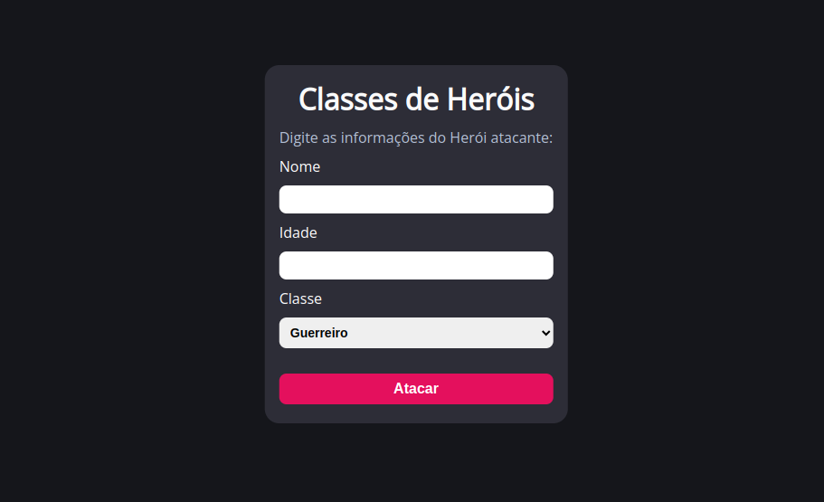

<h1 align="center"> Desafio Classes de Heróis </h1>

Projeto desenvolvido para fins acadêmicos como proposto pela plataforma <a href="https://www.dio.me/">DIO.me</a>.

  <a href="#-tecnologias">Tecnologias</a>&nbsp;&nbsp;&nbsp;|&nbsp;&nbsp;&nbsp;
  <a href="#-projeto">Projeto</a>&nbsp;&nbsp;&nbsp;|&nbsp;&nbsp;&nbsp;
  <a href="#memo-licença">Licença</a>

  

 

  

## 🚀 Tecnologias

Esse projeto foi desenvolvido com as seguintes tecnologias:

- HTML e CSS
- JavaScript
- Git e Github

## 💻 Projeto

# 3️⃣ Escrevendo as classes de um Jogo
 
Explorar todos os conceitos abordados sobre Variáveis, Operadores, Laços de repetição,eEstruturas de decisões, Funções, Classes e Objetos.

**O Que deveria ser utilizado**

- Variáveis
- Operadores
- Laços de repetição
- Estruturas de decisões
- Funções
- Classes e Objetos

## Objetivo

Criar uma classe genérica que represente um herói de uma aventura e que possua as seguintes propriedades:

- nome
- idade
- tipo (ex: guerreiro, mago, monge, ninja )

além disso, deve conter um método chamado atacar que deve atender os seguientes requisitos:

- exibir a mensagem: "o {tipo} atacou usando {ataque}")
- onde o {tipo} deve ser concatenando o tipo que está na propriedade da classe
- e no {ataque} deve seguir uma descrição diferente conforme o tipo, seguindo a tabela abaixo:

se mago -> no ataque exibir (usou magia) 
se guerreiro -> no ataque exibir (usou espada) 
se monge -> no ataque exibir (usou artes marciais) 
se ninja -> no ataque exibir (usou shuriken) 

## Saída

Ao final deve exibir a mensagem:

- "o {tipo} atacou usando {ataque}"

  ex: mago atacou usando magia

- [Acesse o projeto finalizado, online](https://gabriellricardoo.github.io/dio-lab-classes-de-heroi/)

## :memo: Licença

Esse projeto está sob a licença MIT.

---

Layout feito com ♥ by GR
